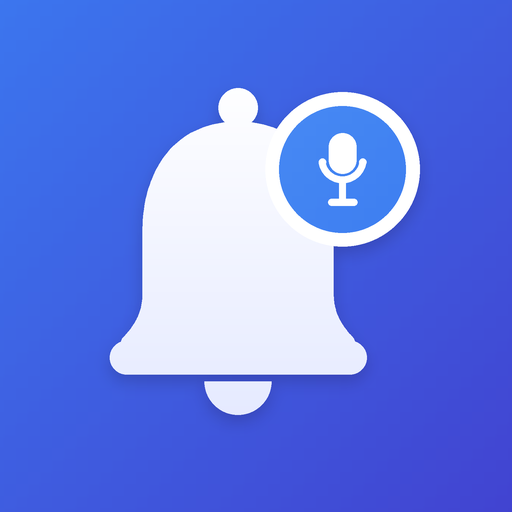
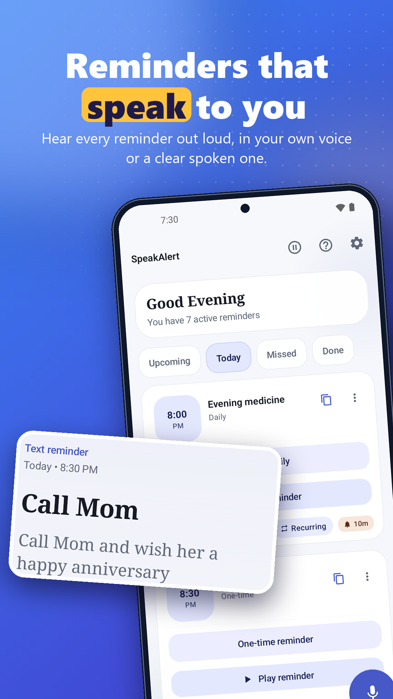
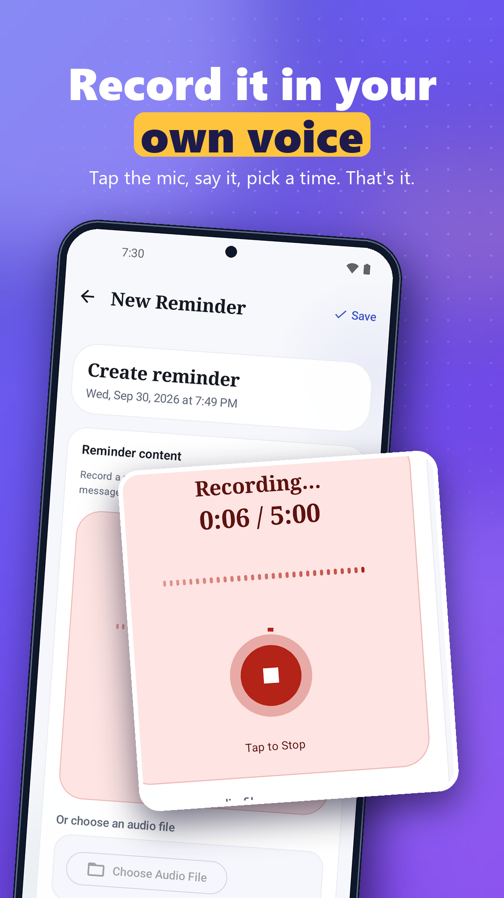
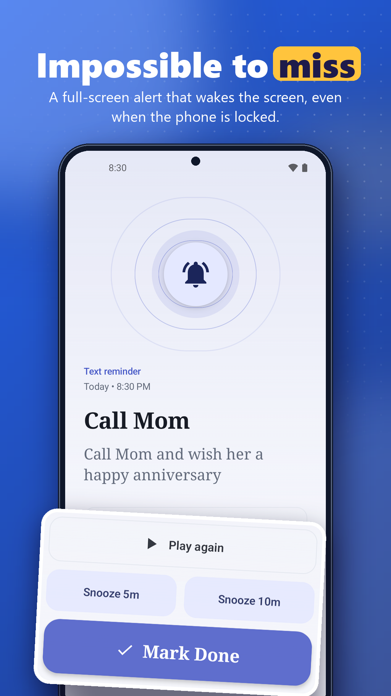
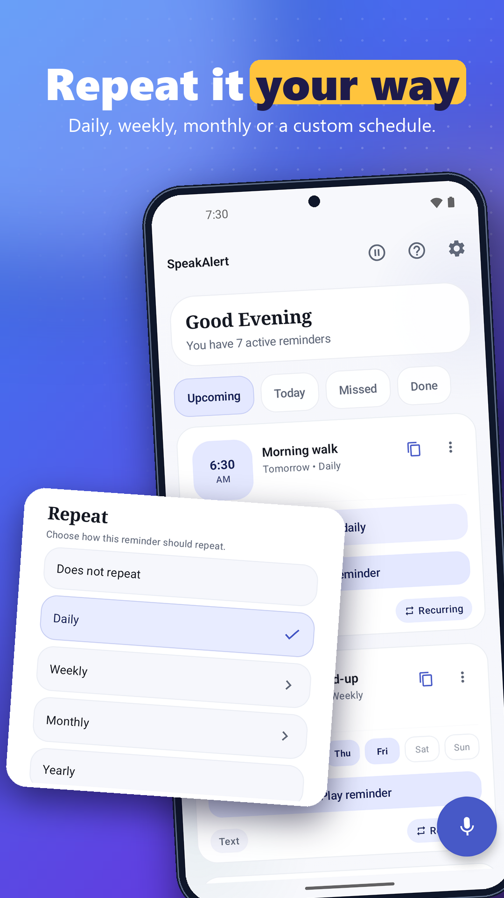

<p align="center">
  
</p>

<h1 align="center">SpeakAlert</h1>

<p align="center">
  Talking reminders for Android, in your own voice or text-to-speech.<br>
  Offline, no account, no ads.
</p>

<p align="center">
  <a href="https://play.google.com/store/apps/details?id=com.ghostgramlabs.speakalert">Google Play</a> ·
  <a href="https://ghostgramlabs.com/SpeakAlert/">Website</a> ·
  <a href="https://ghostgramlabs.com/SpeakAlert/privacy.html">Privacy policy</a> ·
  <a href="LICENSE">Apache 2.0</a>
</p>

<p align="center">
  
  
  
  
</p>

Most reminder apps post a silent notification. SpeakAlert plays the reminder out loud, so you
hear it even when the phone is in your pocket or across the room.

## Features

- **Reminders that talk.** Record your voice, type text for text-to-speech, or pick any audio
  file. Speech uses the reminder's own language (a Hindi reminder is spoken in Hindi).
- **Flexible repeats.** Daily, weekly, monthly, yearly, or custom intervals (every 30 minutes,
  every 3 days). Repeats can end never, on a date, or after a number of times.
- **Reminds until done.** An optional follow-up check re-alerts until you mark the reminder Done.
  Full-screen lock-screen alerts have Done, Silence and Snooze buttons.
- **Reliable delivery.** Exact alarms, rescheduling after reboot, a missed-reminder inbox,
  tone-only mode, optional Do Not Disturb bypass, and battery-optimisation guidance for
  restrictive phones.
- **Private playback.** Play reminders through the earpiece or Bluetooth headphones.
- **Widgets and Wear OS.** A quick-add widget, an upcoming-reminders widget, and alerts on
  Wear OS watches.
- **Backup and restore.** Exports every reminder, voice recordings included.
- **12 languages.** English, Spanish, Hindi, Arabic, Portuguese (Brazil), Russian, Vietnamese,
  Bengali, Telugu, Tamil, Greek and Malayalam, with right-to-left layout support.
- **Fully offline.** No account, no analytics, no network calls for reminders. Data stays on
  the device.

## Building

Requirements:

- Android Studio (Ladybug or newer) or the Android SDK command-line tools
- JDK 17
- Android SDK 36

```bash
git clone https://github.com/ghostgramlabs/SpeakAlert.git
cd SpeakAlert
./gradlew assembleDebug          # Windows: gradlew.bat assembleDebug
```

The debug APK lands in `app/build/outputs/apk/debug/`. Install it on a device or emulator
running Android 8.0 (API 26) or later:

```bash
./gradlew installDebug
```

Debug builds need no configuration. Only release builds need a signing key (see
[Release signing](#release-signing)).

### Running tests

```bash
./gradlew testDebugUnitTest
```

Unit tests live in `app/src/test` and run on the JVM. Exact-alarm and notification behaviour
also needs testing on real devices; [docs/REMINDER_RELIABILITY_TEST_PLAN.md](docs/REMINDER_RELIABILITY_TEST_PLAN.md)
lists the manual checks.

### Release signing

Release builds read their signing key from `local.properties`, which git ignores:

```properties
speakalert.storeFile=your-release-key.jks
speakalert.storePassword=...
speakalert.keyAlias=...
speakalert.keyPassword=...
```

`storeFile` is resolved relative to the `app/` directory. Never commit a keystore or its
passwords.

## Project structure

The app is a single Gradle module written in Kotlin with Jetpack Compose, Room, DataStore,
AlarmManager, WorkManager and Media3, following an MVVM layout.

```
app/src/main/java/com/ghostgramlabs/speakalert/
├── alarm/        Exact-alarm scheduling, alarm receivers, boot rescheduling
├── audio/        Voice recording, processing, playback
├── data/         Room database, DAOs, repositories, backup/restore
├── domain/       Domain models and recurrence logic
├── service/      Foreground playback service and text-to-speech
├── ui/           Compose screens: home, add/edit, details, alert, settings
├── widget/       Home-screen widgets
└── util/         Shared helpers

docs/             Website served at ghostgramlabs.com/SpeakAlert (GitHub Pages)
store/            Play Store listing, screenshots and icons
tools/            Python scripts that generate the icon, screenshots and promo video
```

Translations are in `app/src/main/res/values-*/strings.xml`.

## Permissions

| Permission | Why |
| --- | --- |
| `RECORD_AUDIO` | Record voice reminders |
| `POST_NOTIFICATIONS` | Show reminder alerts (Android 13+) |
| `SCHEDULE_EXACT_ALARM`, `USE_EXACT_ALARM` | Fire reminders at the exact minute |
| `USE_FULL_SCREEN_INTENT` | Full-screen alert on the lock screen |
| `FOREGROUND_SERVICE`, `FOREGROUND_SERVICE_MEDIA_PLAYBACK` | Keep playback running while a reminder speaks |
| `RECEIVE_BOOT_COMPLETED` | Reschedule reminders after a restart |
| `ACCESS_NOTIFICATION_POLICY` | Optional Do Not Disturb bypass |
| `REQUEST_IGNORE_BATTERY_OPTIMIZATIONS` | Ask to be exempted from battery limits that delay alarms |
| `BLUETOOTH_CONNECT` | Route private playback to Bluetooth headphones |
| `WAKE_LOCK`, `VIBRATE` | Wake the device and vibrate on alerts |

## Contributing

Bug reports, translations and pull requests are welcome. See [CONTRIBUTING.md](CONTRIBUTING.md).
To report a security problem, follow [SECURITY.md](SECURITY.md) instead of opening a public issue.

## License

SpeakAlert is released under the [Apache License 2.0](LICENSE). You may use, modify and
redistribute it, including commercially, as long as you keep the copyright notice and the
[NOTICE](NOTICE) file, which credits GhostGram Labs.

The SpeakAlert name and icon are not covered by the license. If you publish a fork, give it its
own name, icon and application ID.

Made by [GhostGram Labs](https://ghostgramlabs.com).
